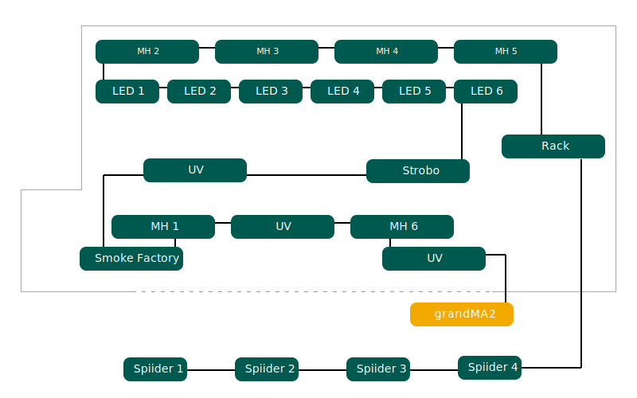

# Technische Dokumentation Turnshow

## Übersicht Bühnenaufbau

Sämtliche Schweinwerfer und die Rauchmaschine sind an einem DMX512-Bus
angeschlossen. Der Bus wird über einen Computer gesteuert, auf welchem grandMA2
onPC läuft.

## DMX-Adresstabelle

| Kanal       | Name                | Produkt                          | Mode      |
| ----------- | ------------------- | -------------------------------- | --------- |
| `001-003` | Tardis Sign RGB     | Generic RGB                      |           |
| `004`      | Tardis Police Light | On/Off                           |           |
| `005`      | Tardis Dim 2        | Generic Dimmer                   |           |
| `006`      | Tardis Dim 3        | Generic Dimmer                   |           |
| `007`      | Tardis Fog          | Generic Dimmer                   |           |
| `008`      | Tardis Spot         | Generic Dimmer                   |           |
| `020`      | Stage Dimmer        | Generic Dimmer                   |           |
| `021`      | Stage Front Middle  | Generic Dimmer                   |           |
| `022`      | Stage Front Side    | Generic Dimmer                   |           |
| `023`      | Stage Center Middle | Generic Dimmer                   |           |
| `024`      | Stage Center Side   | Generic Dimmer                   |           |
| `025`      | Stage Back Middle   | Generic Dimmer                   |           |
| `026`      | Stage Back Side     | Generic Dimmer                   |           |
| `027`      | Face 1 Left         | Generic Dimmer                   |           |
| `028`      | Face 2              | Generic Dimmer                   |           |
| `029`      | Face 3              | Generic Dimmer                   |           |
| `030`      | Face 4 Right        | Generic Dimmer                   |           |
| `040`      | Strobo              | Atomic 3000 DMX                  | 1 channel |
| `050-052` | UV 1                | LED Powerline UV                 |           |
| `053-055` | UV 2                | LED Powerline UV                 |           |
| `056`      | UV Gun              | Briteq LED UV-GUN 100W           |           |
| `060`      | Smoke               | Smoke Factory Captain D.         |           |
| `061-062` | Hazer               | Smoke Factory Tour-Hazer II      |           |
| `100-114` | MH 1 Left           | Martin MAC 250 Moving Head Light | 16 bit    |
| `115-129` | MH 2 Back Left      | Martin MAC 250 Moving Head Light | 16 bit    |
| `130-144` | MH 3 Back           | Martin MAC 250 Moving Head Light | 16 bit    |
| `145-159` | MH 4 Back           | Martin MAC 250 Moving Head Light | 16 bit    |
| `160-174` | MH 5 Back Right     | Martin MAC 250 Moving Head Light | 16 bit    |
| `175-189` | MH 6 Right          | Martin MAC 250 Moving Head Light | 16 bit    |
| `200-205` | LED 1 Left          | LED Powerline 16                 | 6 channel |
| `206-211` | LED 2               | LED Powerline 16                 | 6 channel |
| `212-217` | LED 3               | LED Powerline 16                 | 6 channel |
| `218-223` | LED 4               | LED Powerline 16                 | 6 channel |
| `224-229` | LED 5               | LED Powerline 16                 | 6 channel |
| `230-235` | LED 6 Right         | LED Powerline 16                 | 6 channel |
| `300-332` | Spiider 1 Left      | Robe Spider                      | Mode 3    |
| `333-365` | Spiider 2           | Robe Spider                      | Mode 3    |
| `366-398` | Spiider 3           | Robe Spider                      | Mode 3    |
| `399-431` | Spiider 4 Right     | Robe Spider                      | Mode 3    |

## Verkablung

## Dispatch

### Rack 1

| Regelkreis  | 1     | 2     | 3     | 4     | 5     | 6     |
| ----------- | ----- | ----- | ----- | ----- | ----- | ----- |
| Adresse     | `512` | `512` | `512` | `512` | `512` | `512` |
| Stecker Nr. |       |       |       |       |       |       |
| Stecker Nr. |       |       |       |       |       |       |
| Stecker Nr. |       |       |       |       |       |       |

### Rack 2

| Regelkreis  | 1     | 2     | 3     | 4     | 5     | 6     |
| ----------- | ----- | ----- | ----- | ----- | ----- | ----- |
| Adresse     | `512` | `512` | `512` | `512` | `512` | `512` |
| Stecker Nr. |       |       |       |       |       |       |
| Stecker Nr. |       |       |       |       |       |       |
| Stecker Nr. |       |       |       |       |       |       |

### Rack 3

| Regelkreis  | 1     | 2     | 3     | 4     | 5     | 6     |
| ----------- | ----- | ----- | ----- | ----- | ----- | ----- |
| Adresse     | `512` | `512` | `512` | `512` | `512` | `512` |
| Stecker Nr. |       |       |       |       |       |       |
| Stecker Nr. |       |       |       |       |       |       |
| Stecker Nr. |       |       |       |       |       |       |

## Strom

## MIDI

MIDI Notes werden auf Channel 1 mit voller Velocity (127) gesendet.

| Note  | Name                    | Aktor    |
| ----- | ----------------------- | -------- |
| `001` | Tardis Police Light On  | grandMA2 |
| `002` | Tardis Police Light Off | grandMA2 |
| `020` | Nummer 01 Start         | QLab     |
| `021` | Nummer 01 Zugabe Start  | QLab     |
| `023` | Nummer 02 Start         | QLab     |
| `024` | Nummer 02 Zugabe Start  | QLab     |
| `025` | Nummer 03 Start         | QLab     |
| `026` | Nummer 03 Zugabe Start  | QLab     |
