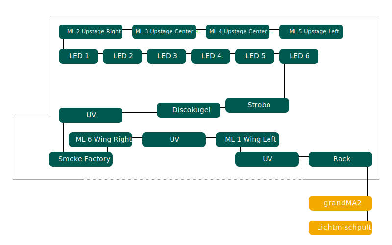

Bühnenaufbau
============

Übersicht
---------

Sämtliche Schweinwerfer und die Rauchmaschine sind an einem DMX512-Bus 
angeschlossen. Der Bus wird über einen Computer, auf welchem grandMA2 onPC 
läuft gesteuert.

DMX-Adresstabelle
-----------------

+-----------+-----------------------+----------------------------------+-----------+
| Kanal     | Name                  | Produkt                          | Mode      |
+===========+=======================+==================================+===========+
| 0001-0003 | Tardis Sign RGB       | Generic RGB                      |           |
+-----------+-----------------------+----------------------------------+-----------+
| 0004      | Tardis Police Light   | On/Off                           |           |
+-----------+-----------------------+----------------------------------+-----------+
| 0005      | Tardis Dim 2          | Generic Dimmer                   |           |
+-----------+-----------------------+----------------------------------+-----------+
| 0006      | Tardis Dim 3          | Generic Dimmer                   |           |
+-----------+-----------------------+----------------------------------+-----------+
| 0007      | Tardis Fog            | Generic Dimmer                   |           |
+-----------+-----------------------+----------------------------------+-----------+
| 0008      | Tardis Spot           | Generic Dimmer                   |           |
+-----------+-----------------------+----------------------------------+-----------+
| 0020      | Stage Dimmer          | Generic Dimmer                   |           |
+-----------+-----------------------+----------------------------------+-----------+
| 0021      | Stage Front Middle    | Generic Dimmer                   |           |
+-----------+-----------------------+----------------------------------+-----------+
| 0022      | Stage Front Side      | Generic Dimmer                   |           |
+-----------+-----------------------+----------------------------------+-----------+
| 0023      | Stage Center Middle   | Generic Dimmer                   |           |
+-----------+-----------------------+----------------------------------+-----------+
| 0024      | Stage Center Side     | Generic Dimmer                   |           |
+-----------+-----------------------+----------------------------------+-----------+
| 0025      | Stage Back Middle     | Generic Dimmer                   |           |
+-----------+-----------------------+----------------------------------+-----------+
| 0026      | Stage Back Side       | Generic Dimmer                   |           |
+-----------+-----------------------+----------------------------------+-----------+
| 0027      | Face 1 Left           | Generic Dimmer                   |           |
+-----------+-----------------------+----------------------------------+-----------+
| 0028      | Face 2                | Generic Dimmer                   |           |
+-----------+-----------------------+----------------------------------+-----------+
| 0029      | Face 3                | Generic Dimmer                   |           |
+-----------+-----------------------+----------------------------------+-----------+
| 0030      | Face 4 Right          | Generic Dimmer                   |           |
+-----------+-----------------------+----------------------------------+-----------+
| 0040      | Strobo                | Atomic 3000 DMX                  | 1 channel |
+-----------+-----------------------+----------------------------------+-----------+
| 0050-0052 | UV 1                  | LED Powerline UV                 |           |
+-----------+-----------------------+----------------------------------+-----------+
| 0053-0055 | UV 2                  | LED Powerline UV                 |           |
+-----------+-----------------------+----------------------------------+-----------+
| 0056      | UV Gun                | Briteq LED UV-GUN 100W           |           |
+-----------+-----------------------+----------------------------------+-----------+
| 0060      | Smoke                 | Smoke Factory Captain D.         |           |
+-----------+-----------------------+----------------------------------+-----------+
| 0061-0062 | Hazer                 | Smoke Factory Tour-Hazer II      |           |
+-----------+-----------------------+----------------------------------+-----------+
| 0100-0114 | MH 1 Left             | Martin MAC 250 Moving Head Light | 16 bit    |
+-----------+-----------------------+----------------------------------+-----------+
| 0115-0129 | MH 2 Back Left        | Martin MAC 250 Moving Head Light | 16 bit    |
+-----------+-----------------------+----------------------------------+-----------+
| 0130-0144 | MH 3 Back             | Martin MAC 250 Moving Head Light | 16 bit    |
+-----------+-----------------------+----------------------------------+-----------+
| 0145-0159 | MH 4 Back             | Martin MAC 250 Moving Head Light | 16 bit    |
+-----------+-----------------------+----------------------------------+-----------+
| 0160-0174 | MH 5 Back Right       | Martin MAC 250 Moving Head Light | 16 bit    |
+-----------+-----------------------+----------------------------------+-----------+
| 0175-0189 | MH 6 Right            | Martin MAC 250 Moving Head Light | 16 bit    |
+-----------+-----------------------+----------------------------------+-----------+
| 0200-0205 | LED 1 Left            | LED Powerline 16                 | 6 channel |
+-----------+-----------------------+----------------------------------+-----------+
| 0206-0211 | LED 2                 | LED Powerline 16                 | 6 channel |
+-----------+-----------------------+----------------------------------+-----------+
| 0212-0217 | LED 3                 | LED Powerline 16                 | 6 channel |
+-----------+-----------------------+----------------------------------+-----------+
| 0218-0223 | LED 4                 | LED Powerline 16                 | 6 channel |
+-----------+-----------------------+----------------------------------+-----------+
| 0224-0229 | LED 5                 | LED Powerline 16                 | 6 channel |
+-----------+-----------------------+----------------------------------+-----------+
| 0230-0235 | LED 6 Right           | LED Powerline 16                 | 6 channel |
+-----------+-----------------------+----------------------------------+-----------+
| 0300-0332 | Spiider 1 Left        | Robe Spider                      | Mode 3    |
+-----------+-----------------------+----------------------------------+-----------+
| 0333-0365 | Spiider 2             | Robe Spider                      | Mode 3    |
+-----------+-----------------------+----------------------------------+-----------+
| 0366-0398 | Spiider 3             | Robe Spider                      | Mode 3    |
+-----------+-----------------------+----------------------------------+-----------+
| 0399-0431 | Spiider 4 Right       | Robe Spider                      | Mode 3    |
+-----------+-----------------------+----------------------------------+-----------+

Verkablung
----------

